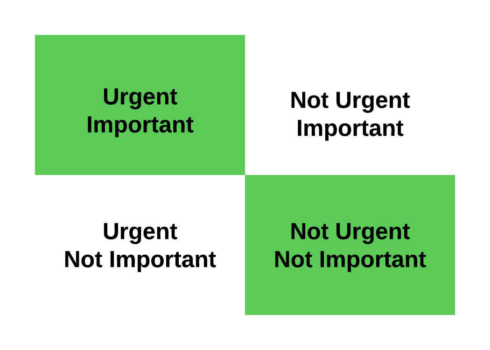

# Building Covey

## Introduction

Throughout my life, writing has been a great mechanism for clarifying and solidifying my thoughts. So, I have decided to experiment with documenting the process of building a piece of software in writing. I am interested to see how writing about my experience might improve my engineering process. At a minimum, I think it will force me to be more deliberate about design choices. I'll have to justify any decisions I make to whatever fictional or real audience I have, which I imagine will have a real refining effect on my decisions. While building readership is not my main priority, I would be thrilled if something I write here ends up being useful or entertaining for someone.

## Why Covey?

I am writing in the now empty second bedroom of my apartment near the campus of Brigham Young University in Provo, UT. My roommates who occupied this room have returned home to weather the COVID-19 storm with their families. Despite their leaving, I made the choice to stay here. The hope that I could maintain some sort of structure in my life was no small part of that decision. Despite my efforts, I regretfully report that all semblance of order is rapidly vanishing. This is where the idea for Covey comes in. I need a way to stay structured and productive.

One of the most productive periods of my life was a couple of years ago when I was just starting college. One of my classes required us to read *The Seven Habits of Highly Effective People* by Stephen R. Covey. The book had a profound impact on the way I directed my life. In short, it made me more deliberate about setting priorities. One of Covey's teachings that resonated with me centered around a 2x2 matrix that separates out different categories of priorities.

  

    
  

In the book, Covey describes how most people end up spending their time doing things that are Urgent and Not Important. These people, he posits, have a hard time making meaningful progress toward their goals. They spend most of their day distracted from meaningful tasks by trivial minutia. Covey suggests that the most effective individuals are those who structure their lives to spend most of their time working on things that are not urgent but are important for achieving their goals.

This brings me back to my first semester of college. I was determined to really move the needle, and Covey's suggestions about time management helped me. I set aside two hours at the beginning of each day to focus on my goals. The first hour was dedicated to scripture study and prayer. I spent the second hour teaching myself how to program. Day after day, I would sit at the same table in the library and go through the Khan Academy Intro to JS course. I had no idea what I was doing. But, this consistent dedication of a focused amount of time steadily moved me to where I wanted to go. By the time I decided to change my major to Computer Science, I knew what a for loop was. 

Those were simple days. The demands on my time that I face now are more varied and unpredictable. So, I can't always keep my schedule consistent. But, I do have plenty of unstructured moments that could be productive if I could quickly decide what to do with them. I want to be able to pick up my computer and have it tell me, instantly, what to do to make progress on my goals. While I expect that perfecting this tool will be an indirect process of iterative improvement via trial and error, my initial thought is to build a system that will help me sift my tasks into the four quadrants of the priority matrix and focus my time on those tasks that are most important. 

## How It Should Work

## Architecture

While I want to start writing code right away, I am trying to resist this urge in favor of doing some mindful planning. I have a few key priorities that I want to keep in mind as I work on this project.

### Maintainability and Extensibility

I have found that my failure to impose strong structure at the beginning of a project has always led to worse and worse code as a project goes on. As I add more features to the shoddy foundation, the project becomes brittle- hard to maintain and extend without breaking it. Given that I am not subject to any time constraints with this project, I want to make sure that I do things right with Covey. At each decision point, I want to make sure that I do the right thing instead of the fast thing. While there are reasons for building quick and dirty software, I have a few reasons for wanting to take the time and effort to build this tool right. Many of these reasons are selfish. For one, I am building this to make my life better, and if it ends up a buggy mess, it will probably just cause me more grief than it is worth. Also, I want this to be easy to maintain. I don't want the project to become so intractable that I start to dread working on it. More magnanimously, if I end up having collaborators on this project, I want it to be easy for them to work on. Also, I would feel bad if others ended up using this tool and found that it was poorly crafted. 

### Tools
